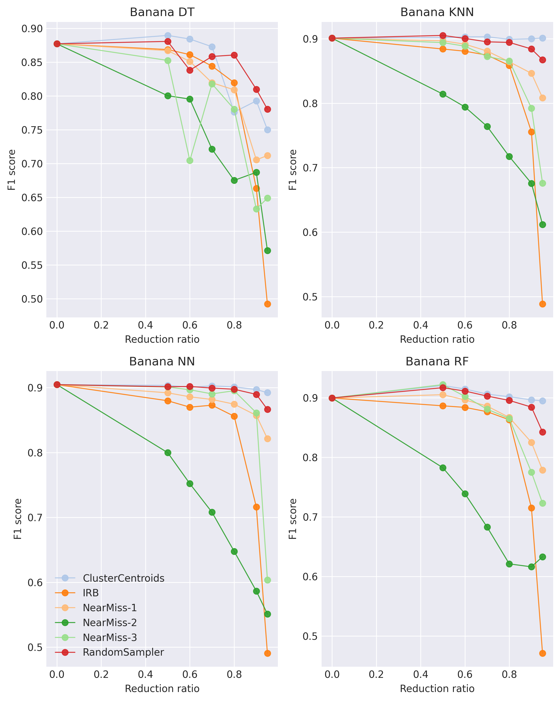
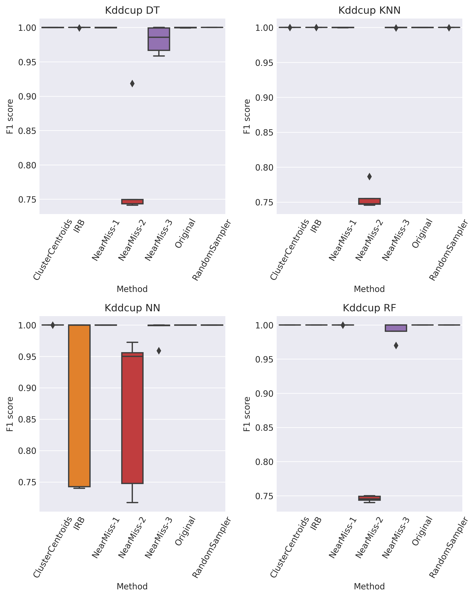
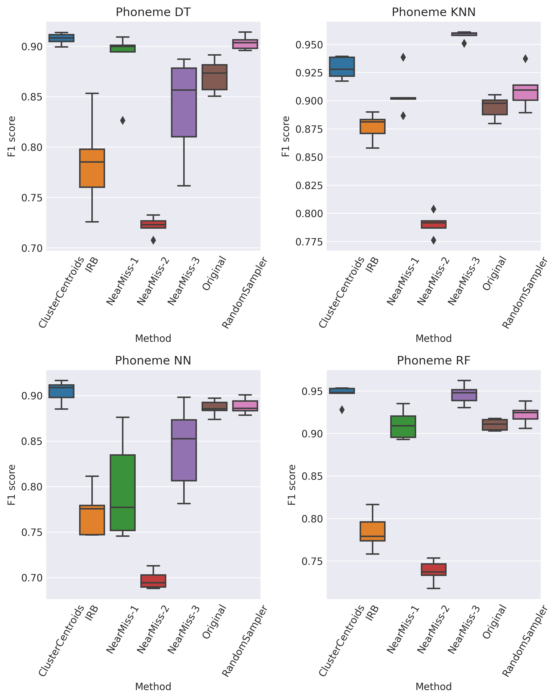

# Paper: Comparison of Controlled Undersampling Methods for Machine Learning
# Experiment Results

 Performance metrics are presented in the two tables. Results for small datasets are shown in Table *Model Evaluation Results on Small Datasets*, whereas the results for the larger datasets can be found in Table *Model Evaluation Results on Large Datasets*.  These tables have the following structure. *F1* scores with standard deviation for each dataset are shown based on the reduction ratio for the tested model and the sampling method. The reduction ratio indicates the amount of data that is removed from the original dataset. The ratio of *0.0* indicates no reduction, while the ratio of *0.9* means that *90%* of the data was removed. The final column displays the mean *F1* score across all reduction ratios, excluding *0.0*. The bold values highlight the optimal method for the given dataset and model. 

## Table with results for small datasets

## Table with results for large datasets

## Visualization of all datasets (Reduction phase line graphs and Deviation boxplots)
### Banana dataset

### Buba dataset

### KDD CUP dataset

### Magic dataset

### Monk-2 dataset

### Phoneme dataset

### Pima dataset

### Ring dataset

## Overall results (Overall F1 score and time consumption)

